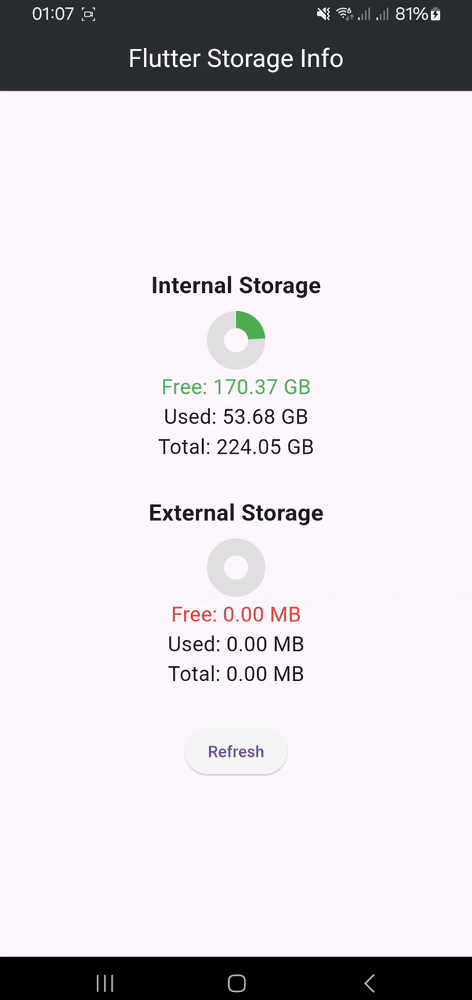

# Flutter Storage Info

A Flutter plugin to retrieve information about device storage.

This plugin provides methods to get information about both internal and external storage space on an Android device.

## Usage

To use this plugin, add `flutter_storage_info` as a [dependency in your pubspec.yaml file](https://flutter.io/platform-plugins/).

```yaml
dependencies:
  flutter_storage_info: ^0.0.5
```

```dart
import 'package:flutter_storage_info/flutter_storage_info.dart';
```

## Example

```dart
import 'package:flutter_storage_info/flutter_storage_info.dart';

void main() async {
  // Fetch the storage info
  int totalSpace = await FlutterStorageInfo.storageTotalSpace;
  int freeSpace = await FlutterStorageInfo.storageFreeSpace;
  int usedSpace = await FlutterStorageInfo.storageUsedSpace;

  print('Total Space: $totalSpace bytes');
  print('Free Space: $freeSpace bytes');
  print('Used Space: $usedSpace bytes');
}
```

## Methods

The following methods are provided by the `FlutterStorageInfo` class:

### Internal Storage (Device Storage)

- `storageFreeSpace`: Retrieves the amount of free space available on the device's internal storage in bytes.
- `storageTotalSpace`: Retrieves the total amount of space available on the device's internal storage in bytes.
- `storageUsedSpace`: Retrieves the amount of used space on the device's internal storage in bytes.

### External Storage (SD Card)

- `externalStorageFreeSpace`: Retrieves the amount of free space available on the device's external storage in bytes.
- `externalStorageTotalSpace`: Retrieves the total amount of space available on the device's external storage in bytes.
- `externalStorageUsedSpace`: Retrieves the amount of used space on the device's external storage in bytes.

### Conversion Methods

- `getStorageSpaceInMB(String method)`: Retrieves the specified storage space in megabytes (MB).
- `getStorageSpaceInGB(String method)`: Retrieves the specified storage space in gigabytes (GB).

### Directory Size

- `getSizeOfDirectoryInMB(String directory)`: Retrieves the size of the specified directory in megabytes (MB).

### Storage Type Detection

- `getStorageTypeFromPath(String path)`: Determines whether the specified path corresponds to internal or external storage. Returns a `DeviceStorageType` enum value (`internal` or `external`).

### Storage Usage Calculation

- `calculateStorageUsage(double storageUsed, double storageTotal)`: Calculates the storage usage value as a ratio (`storageUsed / storageTotal`). Throws an exception if `storageTotal` is less than or equal to zero.

### Low Storage Detection

- `isLowOnStorage(DeviceStorageType storageType, {double threshold = 0.98})`: Checks if the storage usage exceeds the specified threshold (default is 98%). Returns `true` if usage is above the threshold, otherwise `false`.

## Examples

### Get the size of a directory in MB

```dart
String directoryPath = '/storage/emulated/0/Movies/MyFolder';
double directorySize = await FlutterStorageInfo.getSizeOfDirectoryInMB(directoryPath);
print('Directory Size: $directorySize MB');
```

### Determine the storage type from a path

```dart
String path = '/storage/emulated/0/Android';
DeviceStorageType storageType = FlutterStorageInfo.getStorageTypeFromPath(path);
print('Storage Type: $storageType');
```

### Calculate storage usage value

```dart
double storageTotal = await FlutterStorageInfo.getStorageSpaceInGB('getStorageTotalSpaceInGB');
double storageUsed = await FlutterStorageInfo.getStorageSpaceInGB('getStorageUsedSpaceInGB');

double usageValue = FlutterStorageInfo.calculateStorageUsage(storageUsed, storageTotal);
print('Storage Usage Value: $usageValue');
```

### Check if storage is low

```dart
DeviceStorageType storageType = DeviceStorageType.internal;
double threshold = 0.95;

bool isLow = await FlutterStorageInfo.isLowOnStorage(storageType, threshold: threshold);
print('Is Low on Storage: $isLow');
```

## Screenshot



## Permissions

### Android

Add the following permissions to your `AndroidManifest.xml` file:

```xml
<manifest xmlns:android="https://schemas.android.com/apk/res/android"
          package="com.example.app">

    <uses-permission android:name="android.permission.READ_EXTERNAL_STORAGE"/>
    <uses-permission android:name="android.permission.WRITE_EXTERNAL_STORAGE"/>

</manifest>
```

### Supported Platforms

- Android (✅)
- iOS (🕑)
- Linux (❌)
- macOS (❌)
- Windows (❌)

## Issues and Feedback

Please file [issues](https://github.com/JaberQayad/flutter_storage_info/issues) to send feedback or report a bug. Thank you!

