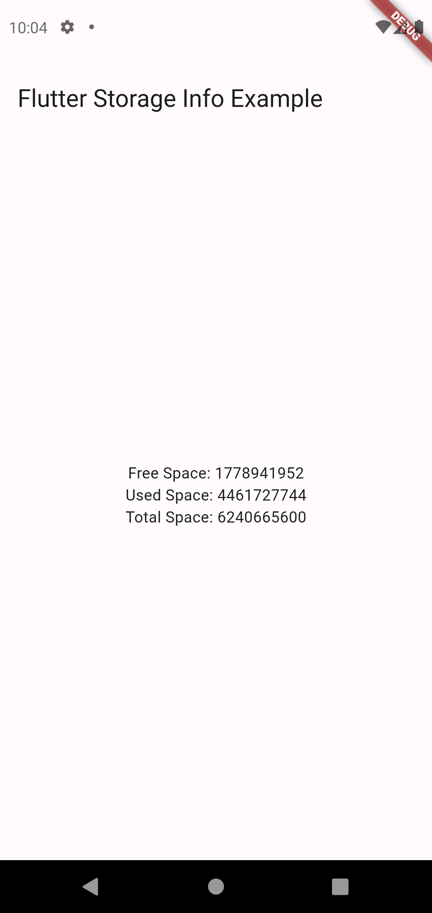

# Flutter Storage Info

A Flutter plugin to retrieve information about device storage.

This plugin provides methods to get information about both internal and external storage space on an Android device.

## Usage 

To use this plugin, add `flutter_storage_info` as a [dependency in your pubspec.yaml file](https://flutter.io/platform-plugins/).


```yaml
dependencies:
  flutter_storage_info: ^0.0.3
```

```dart
import 'package:flutter_storage_info/flutter_storage_info.dart';
```

## Example

```dart
import 'package:flutter_storage_info/flutter_storage_info.dart';

void main() async {
  // Get storage info
  final flutterStorageInfo = FlutterStorageInfo();
    final storageInfo = await flutterStorageInfo.getTotalDiskSpace;
    final freeStorageInfo = await flutterStorageInfo.getFreeDiskSpace;
    final usedStorageInfo = await flutterStorageInfo.getUsedDiskSpace;
    print('Total storage: $storageInfo'); // returns storage in bytes
    print('Free storage: $freeStorageInfo'); // returns storage in bytes
    print('Used storage: $usedStorageInfo'); // returns storage in bytes
}
```

### Supported Platforms
- Android (✅)
- iOS (🕑)
- Linux (❌)
- macOS (❌)
- Windows (❌)

## Methods
`getFreeDiskSpace` - Returns the amount of free space available on the device's internal storage.

`getTotalDiskSpace` - Returns the total amount of space available on the device's internal storage.

`getUsedDiskSpace` - Returns the amount of used space on the device's internal storage.

`getFreeDiskSpaceInGB` - Returns the amount of free space available on the device's internal storage in gigabytes.

`getTotalDiskSpaceInGB` - Returns the total amount of space available on the device's internal storage in gigabytes.

`getUsedDiskSpaceInGB` - Returns the amount of used space on the device's internal storage in gigabytes.

`getFreeDiskSpaceInMB` - Returns the amount of free space available on the device's internal storage in megabytes.

`getTotalDiskSpaceInMB` - Returns the total amount of space available on the device's internal storage in megabytes.

`getUsedDiskSpaceInMB` - Returns the amount of used space on the device's internal storage in megabytes.

`getFreeExternalDiskSpace` - Returns the amount of free space available on the device's external storage.

`getTotalExternalDiskSpace` - Returns the total amount of space available on the device's external storage.

`getUsedExternalDiskSpace` - Returns the amount of used space on the device's external storage.

`getFreeExternalDiskSpaceInGB` - Returns the amount of free space available on the device's external storage in gigabytes.

`getTotalExternalDiskSpaceInGB` - Returns the total amount of space available on the device's external storage in gigabytes.

`getUsedExternalDiskSpaceInGB` - Returns the amount of used space on the device's external storage in gigabytes.

`getFreeExternalDiskSpaceInMB` - Returns the amount of free space available on the device's external storage in megabytes.

`getTotalExternalDiskSpaceInMB` - Returns the total amount of space available on the device's external storage in megabytes.

`getUsedExternalDiskSpaceInMB` - Returns the amount of used space on the device's external storage in megabytes.




## Permissions

### Android
Add the following permissions to your AndroidManifest.xml file:

```xml
<uses-permission android:name="android.permission.READ_EXTERNAL_STORAGE"/>
<uses-permission android:name="android.permission.WRITE_EXTERNAL_STORAGE"/>
```


## Issues and feedback

Please file [issues] to send feedback or report a bug. Thank you!


